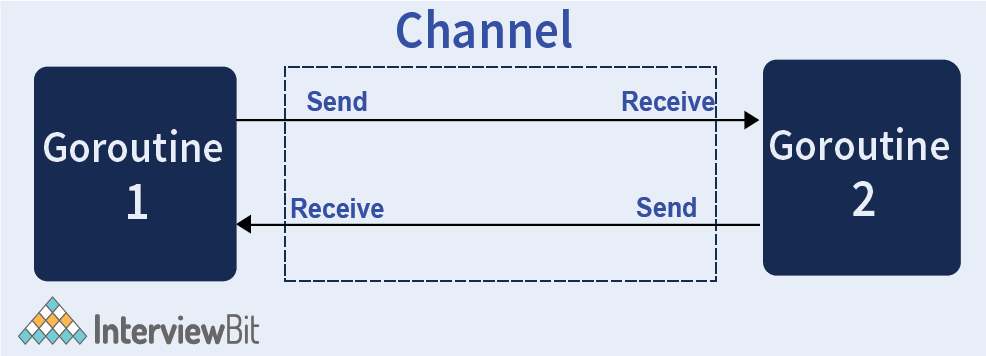

# Concurrency in GoLang
- Go provides very good support for concurrency using [Go Routines or channels](https://go.dev/tour/concurrency/1).
- They take advantage of efficient memory management strategies and [multicore processor architecture](https://www.techtarget.com/searchdatacenter/definition/multi-core-processor) for implementing concurrency.
- Go has first-class supports for Concurrency having the ability to use [multi-core processor architectures](https://www.techtarget.com/searchdatacenter/definition/multi-core-processor) to the advantage of the developer and utilize memory efficiently.

# Constructs

| Construct                                        | Package    | Description                                                                                                                                                                        | Sample Code                                                                                                                                                                                                                                                                                               |
|--------------------------------------------------|------------|------------------------------------------------------------------------------------------------------------------------------------------------------------------------------------|-----------------------------------------------------------------------------------------------------------------------------------------------------------------------------------------------------------------------------------------------------------------------------------------------------------|
| [Mutex](https://gobyexample.com/mutexes)         | sync       | We can use a mutex to safely access data across multiple goroutines.<br/>- Lock the mutex before accessing counters; unlock it at the end of the function using a defer statement. | type Test struct { mu sync.Mutex }<br/>- c.mu.Lock()<br/>- defer c.mu.Unlock()<br/>- c.counter++                                                                                                                                                                                                          |
| [WaitGroup](https://pkg.go.dev/sync#WaitGroup)   | sync       | A WaitGroup waits for a collection of goroutines to finish. The main goroutine calls Add to set the number of goroutines to wait for.                                              | var wg sync.WaitGroup<br/>- wg.Add(1) // Always call wg.Add() before you launch the goroutine that will call wg.Done().<br/>- wg.Done() //Recommended to call WaitGroup.Done() deferred, so it gets called even if the goroutine panics.<br/>-wg.Wait() //wg.Wait() will block until wg.Done() is called. |
| [Once](https://pkg.go.dev/sync#Once)             | sync       | Once is an object that will perform exactly one action.                                                                                                                            | var once sync.Once<br/>- once.Do(func() {singleInstance = new(single)})                                                                                                                                                                                                                                                                                 |

# GoRoutines
- [A Goroutine](https://go.dev/tour/concurrency/1) is a function or method which executes independently and simultaneously in connection with any other Goroutines present in your program. ([asynchronous function execution](https://medium.com/@gauravsingharoy/asynchronous-programming-with-go-546b96cd50c1))
- Goroutines, can be very cheap (light weighted thread): they have little overhead beyond the memory for the stack, which is just a few kilobytes.
- All the Goroutines are working under the main Goroutines if the main Goroutine terminated, then all the goroutine present in the program also terminated. Goroutine always works in the background.
- When a new Goroutine executed, the Goroutine call return immediately. 
- The control does not wait for Goroutine to complete their execution just like normal function they always move forward to the next line after the Goroutine call and ignores the value returned by the Goroutine.
- Goroutines can communicate using the channel and these channels are specially designed to prevent race conditions when accessing shared memory using Goroutines.

## Example1

````go
var wg sync.WaitGroup
var v int32 = 0 
for i = 0; i < 100; i++{
   wg.Add(1) //right place to put wg.add(1)
   go func(){
       defer wg.Done()
       atomic.AddInt32(&v,1)
   } 
}
wg.Wait()
fmt.Println(v)
````

## Example2

````go
// Go program to illustrate the concept of Goroutine
package main

import "fmt"

func display(str string) {
	for w := 0; w < 6; w++ {
        time.Sleep(1 * time.Second)
		fmt.Println(str)
	}
}

func main() {

	// Calling Goroutine
	go display("Welcome")

	// Calling normal function
	display("GeeksforGeeks")
}
````

# Go Channels (to communicate b/w go routines)
- Channels are a typed conduit through which you can send and receive values with the channel operator, <-.
- By default, sends and receives block until the other side is ready. 
- This allows goroutines to synchronize without explicit locks or condition variables.

  

[Read more](https://www.geeksforgeeks.org/channel-in-golang/)

| Title                                        | Code                                                      |
|----------------------------------------------|-----------------------------------------------------------|
| Create Channel                               | Mychannel:= make(chan Type)<br/>- var Mychannel chan Type |
| Send data to Channel                         | Mychannel <- element // Send data to Mychannel            |
| Receive data from Mychannel - BLOCKING CALL. | element := <-Mychannel<br/>- log.Println(<-Mychannel)     |

## Example Code

````go
package main

import (
	"log"
	"net/http"
	"time"
)

func main() {
	links := []string{
		"http://facebook.com",
		"http://linkedin.com",
		"http://google.com",
	}

	c := make(chan string)

	for _, link := range links {
		go checkLinkStatus(link, c)
	}

	for l := range c {
		go func(url string) {
			time.Sleep(time.Second)
			checkLinkStatus(url, c)
		}(l)

		//go checkLinkStatus(<-c, c)
		//log.Println(<-c)
	}
}

func checkLinkStatus(url string, c chan string) {

	if _, err := http.Get(url); err != nil {
		log.Println(url, "is down")
		c <- url
		return
	}

	c <- url
	log.Println(url, "is up")
}
````

# Select Statement in Golang
- [Golang select statement](https://golangdocs.com/select-statement-in-golang) is like the switch statement, which is used for multiple channels operation.
- This statement blocks until any of the cases provided are ready.
- [time.After() Function in Golang With Examples](https://www.geeksforgeeks.org/time-after-function-in-golang-with-examples/)

````go
package main
 
import (
    "fmt"
)
 
func g1(ch chan int) {
    ch <- 12
}
 
func g2(ch chan int) {
    ch <- 32
}
 
func main() {
 
    ch1 := make(chan int)
    ch2 := make(chan int)
 
    go g1(ch1)
    go g1(ch2)
 
    select {
    case v1 := <-ch1:
        fmt.Println("Got: ", v1)
    case v2 := <-ch2:
        fmt.Println("Got: ", v2)
    }
}
````

# Concurrency is not Parallelism

## :star: Difference between concurrent and parallelism in Golang
- Concurrency is when your program can handle multiple tasks at once while parallelism is when your program can execute multiple tasks at once using multiple processors.
- In other words, concurrency is a property of a program that allows you to have multiple tasks in progress at the same time, but not necessarily executing at the same time. (i.e. instead of keeping idle while waiting for the blocking call, we optimize and execute another code.)
- Parallelism is a runtime property where two or more tasks are executed at the same time.

## Why doesn't my program run faster with more CPUs?
- Whether a program runs faster with more CPUs depends on the problem it is solving. 
- The Go language provides concurrency primitives, such as goroutines and channels, but concurrency only enables parallelism when the underlying problem is intrinsically parallel. 
- Problems that are intrinsically sequential cannot be sped up by adding more CPUs, while those that can be broken into pieces that can execute in parallel can be sped up, sometimes dramatically.

Sometimes adding more CPUs can slow a program down. 
- In practical terms, programs that spend more time synchronizing or communicating than doing useful computation may experience performance degradation when using multiple OS threads. 
- This is because passing data between threads involves switching contexts, which has significant cost, and that cost can increase with more CPUs.

## How can I control the number of CPUs?
- The number of CPUs available simultaneously to executing goroutines is controlled by the [GOMAXPROCS](https://pkg.go.dev/runtime) shell environment variable, whose default value is the number of CPU cores available.
- Programs with the potential for parallel execution should therefore achieve it by default on a multiple-CPU machine.

# References
- [Go Concurrency Patterns: Timing out, moving on](https://go.dev/blog/concurrency-timeouts)
- [Crack the top 50 Golang interview questions](https://www.educative.io/blog/50-golang-interview-questions)
- [Goroutine Leaks - The Forgotten Sender](https://www.ardanlabs.com/blog/2018/11/goroutine-leaks-the-forgotten-sender.html)
- [Mutex in Golang](https://golangdocs.com/mutex-in-golang)
- [Why is my goroutine not executed?](https://stackoverflow.com/questions/24425987/why-is-my-goroutine-not-executed)