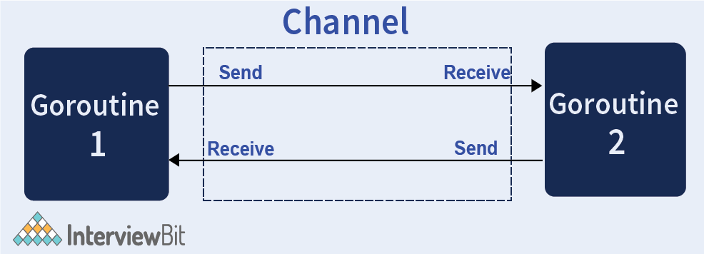

# Go Channels (to communicate b/w go routines)
- Channels are a typed conduits through which you can send and receive values with the channel operator, <-.
- By default, sends and receives block until the other side is ready.
- This allows goroutines to synchronize without explicit locks or condition variables.
- These [channels](Readme.md) are specially designed to prevent race conditions when accessing shared memory using Goroutines.

# Go Channels constructs 

| Title                                        | Code                                                      |
|----------------------------------------------|-----------------------------------------------------------|
| Create Channel                               | Mychannel:= make(chan Type) - var Mychannel chan Type |
| Send data to Channel                         | Mychannel <- element // Send data to Mychannel            |
| Receive data from Mychannel - BLOCKING CALL. | element := <-Mychannel - log.Println(<-Mychannel)     |

# Types

|                     | Description                                                                                                              |
|---------------------|--------------------------------------------------------------------------------------------------------------------------|
| Unbuffered channels | Unbuffered channels block the sender until a receiver is ready (and vice versa), making them useful for synchronization. |
| Buffered channels   | Buffered channels allow limited queuing — senders block only when the buffer is full.                                    |

# Common Problems

|                                         | Description                                                                                                                                                                        |
|-----------------------------------------|------------------------------------------------------------------------------------------------------------------------------------------------------------------------------------|
| Deadlocks                               | Forgetting to receive from a channel, causing goroutines to block forever.                                                                                                         |
| Goroutine leaks                         | Starting goroutines that write to a channel, but no receiver exists or the channel is closed, so the goroutine hangs forever.                                                      |
| Improper channel closing                | Closing a channel from the receiver side or closing a channel multiple times — both will panic. The rule is: the sender should close the channel when no more values will be sent. |
| Over-relying on channels for everything | Sometimes simpler concurrency-safe data structures (e.g., sync.Mutex, sync.Map) or worker pools are better suited                                                                  |

# Best Practices

|                                                                                  |
|----------------------------------------------------------------------------------|
| Use [select](Select.md) with default or ctx.Done() to avoid blocking forever. |
| Always design clear ownership: who closes the channel, and when?                 |
| Prefer simple patterns — e.g., fan-out / fan-in — to manage complexity.          |

# Reference
- [Read more](https://www.geeksforgeeks.org/channel-in-golang/)