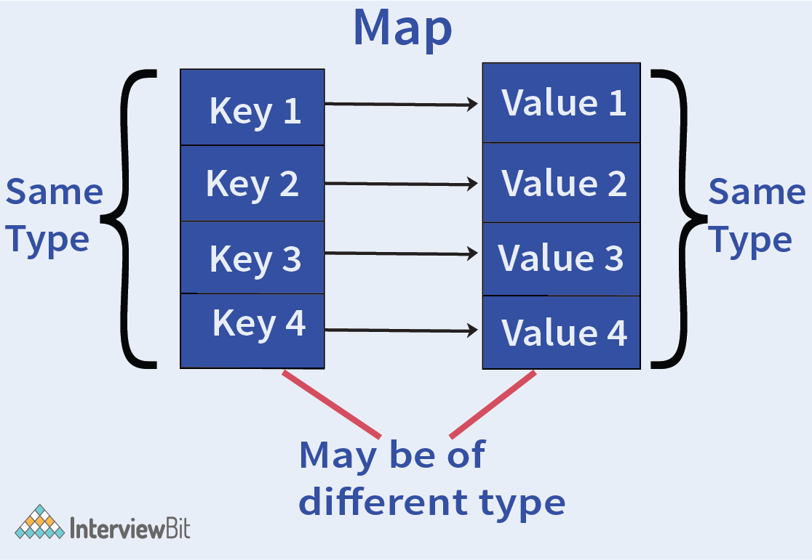

# What do you understand by Golang string literals?
- String literals are those variables storing string constants that can be a single character or that can be obtained as a result of the concatenation of a sequence of characters.
- Go provides two types of string literals - Raw & Interpreted string literals.

## Raw string literals

```go
`interviewbit`
```

## Interpreted string literals

```go
"Interviewbit
Website"
```

# What is the syntax used for the for loop in Golang?

```go
for [condition |  ( init; condition; increment ) | Range]  
{  
statement(s);  
//more statements
}  
```

# What do you understand by the scope of variables in Go?

## Local variables
- These are declared inside a function or a block and is accessible only within these entities.

## Global variables
- These are declared outside function or block and is accessible by the whole source file.

# How can we check if the Go map contains a key?



```go
if val, isExists := map_obj["foo"]; isExists {
    //do steps needed here
}
```

# Can you format a string without printing?

```go
return fmt.Sprintf ("Size: %d MB.", 50)
```

# Closures in Golang
- Go language provides a special feature known as an anonymous function.
- [An anonymous function can form a closure](https://www.geeksforgeeks.org/closures-in-golang/).

````go
// Golang program to illustrate how
// to create a Closure
package main

import "fmt"

func main() {
	
	// Declaring the variable
	GFG := 0

	// Assigning an anonymous
	// function to a variable
	counter := func() int {
	GFG += 1
	return GFG
	}

	fmt.Println(counter())
	fmt.Println(counter())	
}
````

# Scan Function in GoLang
- The [Scan function](https://www.educative.io/answers/what-is-the-scan-function-in-golang) in the Go programming language is used to read data from the standard input, format the string, and store the resultant strings into the destinations specified by the additional arguments.

````go
package main
 
import (
    "fmt"
)
 
func main() {
 
  var name string
  var unit string
  var amount int
  var temp string

  // taking input and storing in variable using a sample input string would be:
  // "Faraz owns 500 acres of land"
  fmt.Scan(&name, &temp, &amount, &unit)
 
  // print out new string using the extracted values 
  fmt.Printf ("% d %s of land is owned by %s\n",amount, unit, name);
}
````

# Format the string
- In Go, the %s verb is used to format a string.
- When used with a custom type that has a String() method defined, the String() method will be automatically called and its return value will be used in the formatted string.

# Variadic Functions in Go
- The function that is called with the varying number of arguments is known as variadic function.

`````go
function function_name(para1, para2...type)type {// code...}
`````

# Switch
- One interesting thing about [switch statements](https://exercism.org/tracks/go/exercises/blackjack/edit), is that the value after the switch keyword can be omitted, and we can have boolean conditions for each case.

````go
age := 21

switch {
case age > 20 && age < 30:
    // do something if age is between 20 and 30
case age == 10:
    // do something if age is equal to 10
default:
    // do something else for every other case
}
````

# References
- [Frequently Asked Questions (FAQ)](https://go.dev/doc/faq)
- [Golang Interview Questions](https://www.interviewbit.com/golang-interview-questions/)